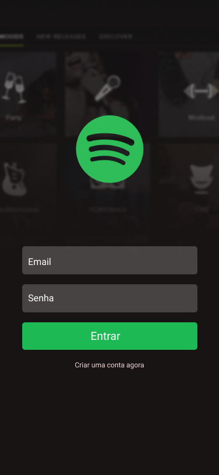

# Spotify UI Clone 

<h4 align="center">
    Projeto para entender como funciona o React Native e seus componentes nativos
</h4>

## :art: Layout




## :hammer_and_wrench: Techs 

[x] React Native
[x] React Navigation

## :desktop_computer: Como usar
##### 

Rode no Terminal
```
    npx react-native run-android
    npx react-native start
```
